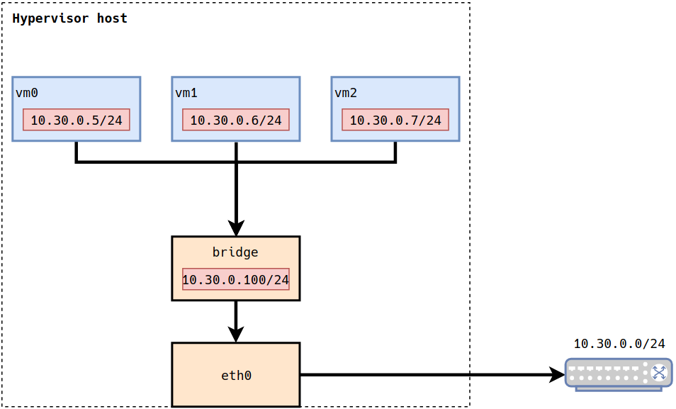

# Virtual Machine (VM) Bridge Network Interface

This post uses standard tooling to create and configure a bridge on any Linux distribution.

## Why Use a Bridge?

In the realm of VMs, a bridge interface can act as a virtual switch that VMs may interface with. Like any switch, this enables routing at layer 2 routing amongst VMs. Additionally, assuming the bridge is attached to an interface with external network access, the VMs are able to route externally. In the end, VMs attached to the bridge interface will be addressable via DHCP, allowing direct access on a network. A simplified diagram of what the model looks like follows.

<center></center>

In the above diagram, bridge and eth0 are interfaces. Each VM's address is accessible from hosts taking part in the `10.30.0.0/24` address space.

## Tooling

This post covers using [iproute2](https://en.wikipedia.org/wiki/Iproute2) `ip` to setup a network bridge for your VMs. Many tutorials use bridge-utils `brctl`. bridge-utils has been [deprecated](https://lwn.net/Articles/703776) in favor of iproute2. 

## Setting Up a Bridge

1. Show all interfaces known to your machine.

    ```
    ip address
    ```

1. Examine the output, identify the interface representing your NIC.

    ```
    1: lo: <LOOPBACK,UP,LOWER_UP> mtu 65536 qdisc noqueue state UNKNOWN group default qlen 1000
        link/loopback 00:00:00:00:00:00 brd 00:00:00:00:00:00
        inet 127.0.0.1/8 scope host lo
        valid_lft forever preferred_lft forever
        inet6 ::1/128 scope host 
        valid_lft forever preferred_lft forever

    2: eno1: <BROADCAST,MULTICAST,UP,LOWER_UP> mtu 1500 qdisc fq_codel state UP group default qlen 1000
        link/ether 74:d4:35:ed:79:d7 brd ff:ff:ff:ff:ff:ff
        inet 192.168.0.100/24 brd 192.168.0.255 scope global dynamic noprefixroute eno1
        valid_lft 86114sec preferred_lft 86114sec
        inet6 fe80::c381:9d28:91e:7b8/64 scope link noprefixroute 
        valid_lft forever preferred_lft forever
    ```

    In the above, `eno1` represents the NIC for your ethernet card. `eno1` also has an address associated with it via DHCP, this will need to be flushed before setting up the bridge. Note that bridging with wireless interfaces requires more work. It is also assumes This post assumes a ethernet-based interface.
    
    Going forward, this post will refer to your ethernet interface name as `$IF`.

1. Flush any existing IP address from the ethernet interface.

    ```
    ip address flush dev $IF
    ```

1. Create the bridge device.

    ```
    ip link add br0 type bridge
    ```

    * `br0`: is the device name. This will show when using `ip address`.

1. Attach the ethernet interface from the above step to the bridge.

    ```
    ip link set $IF master br0
    ```

    `master`: enslaves the device to `br0`. Packets sent to `$IF` and sent through `br0`.

1. Bring the ethernet interface up.

    ```
    ip link set $IF up
    ```

1. Check the link status of `$IF` and `br0`.

    ```
    ip address
    ```

    ```
    2: eno1: <BROADCAST,MULTICAST,UP,LOWER_UP> mtu 1500 qdisc fq_codel master br0 state UP group default qlen 1000
        link/ether 74:d4:35:ed:79:d7 brd ff:ff:ff:ff:ff:ff

    3: br0: <BROADCAST,MULTICAST,UP,LOWER_UP> mtu 1500 qdisc noqueue state UP group default qlen 1000
        link/ether 74:d4:35:ed:79:d7 brd ff:ff:ff:ff:ff:ff
        inet6 fe80::76d4:35ff:feed:79d7/64 scope link 
        valid_lft forever preferred_lft forever

    ```

1. Retrieve an IP address for the bridge using DHCP.

    ```
    dhclient -v br0
    ```

    * `-v`: verbose output.

1. Verify the bridge has an IP assigned to it.

    ```
    ip address
    ```

    ```
    2: eno1: <BROADCAST,MULTICAST,UP,LOWER_UP> mtu 1500 qdisc fq_codel master br0 state UP group default qlen 1000
    link/ether 74:d4:35:ed:79:d7 brd ff:ff:ff:ff:ff:ff

    3: br0: <BROADCAST,MULTICAST,UP,LOWER_UP> mtu 1500 qdisc noqueue state UP group default qlen 1000
        link/ether 74:d4:35:ed:79:d7 brd ff:ff:ff:ff:ff:ff
        inet 192.168.0.100/24 brd 192.168.0.255 scope global br0
        valid_lft forever preferred_lft forever
        inet6 fe80::76d4:35ff:feed:79d7/64 scope link
        valid_lft forever preferred_lft forever
    ```

1. Launch VMs and and set their interface to `br0`.

    ```
     virt-install \
        --name ubuntu0 \
        --ram 1024 \
        --disk path=./ubuntu0.qcow2,size=8 \
        --vcpus 1 \
        --os-type linux \
        --os-variant ubuntu \
        --network bridge=br0 \
        --graphics vnc,port=5999 \
        --console pty,target_type=serial \
        --cdrom ./ubuntu-18.iso \
    ```

    The above uses `virt-install` to spin up a KVM-based VM. Using different tools such as `virt-manager` or other VM provisioners work too. Just ensure the network bridge is set to `br0`.

## Automating / Persisting the Bridge

There are multiple ways to automate the creation and configuration of your bridge. Many of these approaches are distribution specific. In Debian/Ubuntu there is [/etc/network/interfaces](https://help.ubuntu.com/community/NetworkConnectionBridge#Automatically_Create_the_Bridge_at_Start-up) and in Fedora/RHEL there is [/etc/sysconfig/network-scripts](https://access.redhat.com/documentation/en-us/red_hat_enterprise_linux/6/html/deployment_guide/s1-networkscripts-interfaces). My non-ESXi hypervisor hosts are laptops, desktops, and other janky machines that run anything from Arch Linux to Ubuntu. Thus I prefer an approach that is easy to reason about and agnostic to distribution. The following automation is not appropriate for your data center, but great for a home lab.

1. Disable existing network or DHCP-client services.

    You should ensure you are in control of DHCP leases. If you are running services like `NetworkManager` or `dhcpcd`, be sure they are disabled to prevent conflict with this automation.

1. Install `dhclient` on your machine.

    ```
    pacman -S dhclient
    ```
    `dhclient` is a simple way to request an IP lease via DHCP. Replace `pacman` with your host's package manager.

1. Create `net-start` with the following content.

    ```bash
    #!/bin/bash
    BRIDGE=br0
    IF=eno1

    echo "creating bridge: $BRIDGE"
    ip link add name $BRIDGE type bridge

    echo "bringing up interfaces: $IF and $BRIDGE"
    ip link set $IF up

    echo "adding interface into the bridge: $IF -> $BRIDGE"
    ip link set $IF master $BRIDGE

    echo "dhclient requesting ip for bridge: $BRIDGE"
    dhclient -v $BRIDGE

    echo "completed net-start"
    ```

1. Set `$BRIDGE` above with your desired bridge name.

1. Set `$IF` above with your machine's ethernet interface.

    Alternatively, do some scripting magic to detect the interface name. I prefer to keep it static and simple.

1. Save the file and make it executable.

    ```
    chmod +x net-start
    ```

1. Move the file to `/usr/local/bin`.

    ```
    mv net-start /usr/local/bin
    ```

1. Create  `/etc/systemd/system/net-start.service` unit with the following content.

    ```
    [Unit]
    Description=net-start

    [Service]
    ExecStart=/usr/local/bin/net-start

    [Install]
    WantedBy=default.target
    ```

1. Reload the systemd daemon so that `net-start` is recognized.

    ```
    systemctl daemon-reload
    ```

1. Enable the `net-start` unit so that it is triggered on boot.

    ```
    systemctl enable net-start
    ```

1. Reboot the machine.

    ```
    reboot
    ```

1. Examine the net-start logs to ensure an IP was leased.

    ```
    journalctl -u net-start
    ```

    ```
    Mar 09 22:23:53 tugboat systemd[1]: Started net-start.
    Mar 09 22:23:53 tugboat net-start[573]: creating bridge: br0
    Mar 09 22:23:53 tugboat net-start[573]: bringing up interfaces: eno1 and br0
    Mar 09 22:23:53 tugboat net-start[573]: adding interface into the bridge: eno1 -> br0
    Mar 09 22:23:53 tugboat net-start[573]: dhclient requesting ip for bridge: br0
    Mar 09 22:23:53 tugboat dhclient[583]: Internet Systems Consortium DHCP Client 4.4.1
    Mar 09 22:23:53 tugboat net-start[573]: Internet Systems Consortium DHCP Client 4.4.1
    Mar 09 22:23:53 tugboat net-start[573]: Copyright 2004-2018 Internet Systems Consortium.
    Mar 09 22:23:53 tugboat net-start[573]: All rights reserved.
    Mar 09 22:23:53 tugboat net-start[573]: For info, please visit https://www.isc.org/software/dhcp/
    Mar 09 22:23:53 tugboat dhclient[583]: Copyright 2004-2018 Internet Systems Consortium.
    Mar 09 22:23:53 tugboat dhclient[583]: All rights reserved.
    Mar 09 22:23:53 tugboat dhclient[583]: For info, please visit https://www.isc.org/software/dhcp/
    Mar 09 22:23:53 tugboat dhclient[583]: 
    Mar 09 22:23:53 tugboat dhclient[583]: Listening on LPF/br0/74:d4:35:ed:79:d7
    Mar 09 22:23:53 tugboat net-start[573]: Listening on LPF/br0/74:d4:35:ed:79:d7
    Mar 09 22:23:53 tugboat net-start[573]: Sending on   LPF/br0/74:d4:35:ed:79:d7
    Mar 09 22:23:53 tugboat net-start[573]: Sending on   Socket/fallback
    Mar 09 22:23:53 tugboat net-start[573]: DHCPREQUEST for 192.168.0.100 on br0 to 255.255.255.255 port 67
    Mar 09 22:23:53 tugboat dhclient[583]: Sending on   LPF/br0/74:d4:35:ed:79:d7
    Mar 09 22:23:53 tugboat dhclient[583]: Sending on   Socket/fallback
    Mar 09 22:23:53 tugboat dhclient[583]: DHCPREQUEST for 192.168.0.100 on br0 to 255.255.255.255 port 67
    Mar 09 22:23:58 tugboat dhclient[583]: DHCPREQUEST for 192.168.0.100 on br0 to 255.255.255.255 port 67
    Mar 09 22:23:58 tugboat net-start[573]: DHCPREQUEST for 192.168.0.100 on br0 to 255.255.255.255 port 67
    Mar 09 22:23:58 tugboat dhclient[583]: DHCPACK of 192.168.0.100 from 192.168.0.1
    Mar 09 22:23:58 tugboat net-start[573]: DHCPACK of 192.168.0.100 from 192.168.0.1
    Mar 09 22:23:58 tugboat dhclient[583]: bound to 192.168.0.100 -- renewal in 34168 seconds.
    Mar 09 22:23:58 tugboat net-start[573]: bound to 192.168.0.100 -- renewal in 34168 seconds.
    Mar 09 22:23:58 tugboat net-start[573]: completed net-start
    Mar 09 22:23:58 tugboat systemd[1]: net-start.service: Succeeded.
    ```